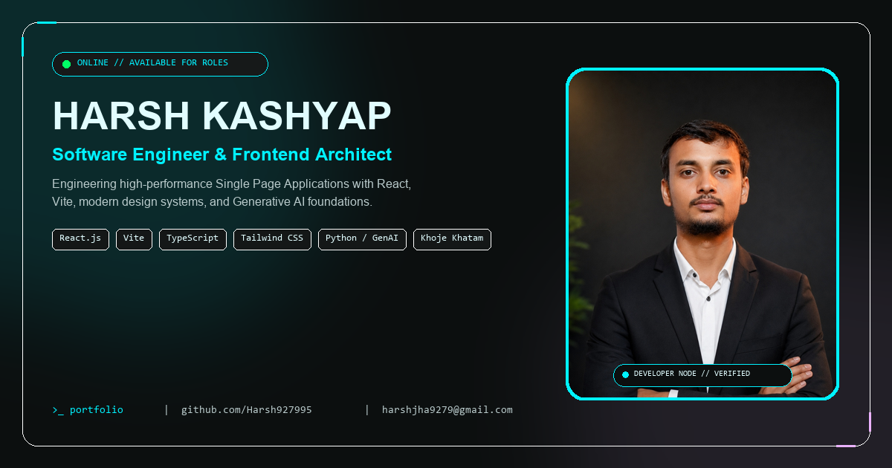

# DEV_CORE — Cyber-Premium Developer Portfolio

<div align="center">



[](https://react.dev/)
[](https://www.typescriptlang.org/)
[](https://vitejs.dev/)
[](https://tailwindcss.com/)
[](LICENSE)

**An interactive, next-generation engineering portfolio and telemetry console built with React 18, TypeScript, and modern Cyber-Glass aesthetics.**

[Live Demo](https://harsh927995.github.io/portfolio/) • [Author Profile](https://github.com/Harsh927995) • [Report Issue](https://github.com/Harsh927995/portfolio/issues)

</div>

---

## ⚡ Highlights & Key Features

- **💻 In-Browser Interactive IDE Code Runner**:
  - Multi-file tabbed code simulation executing live JavaScript, TypeScript, and diagnostic shell commands directly inside the hero section (`passion.js`, `architecture.ts`, `diagnostics.sh`).
- **📟 Global CLI Terminal Modal (`Ctrl + K` or `~`)**:
  - Fully keyboard-driven interactive CLI shell with built-in commands: `help`, `about`, `skills`, `projects`, `telemetry`, `cv`, `clear`, and `exit`.
- **📄 Automated ATS-Compliant 1-Page CV Generator**:
  - Embedded executive curriculum vitae modal with instant print, copy Markdown, and automated ReportLab PDF download.
- **💎 Cyber-Premium Dark Glassmorphism UI**:
  - Deep-space void backdrop (`#121414`), neon cyber-cyan (`#00f2ff`) and purple (`#ebb2ff`) accents, glassmorphic backdrop-blur cards, and smooth micro-animations.
  - Pre-painted canvas eliminating any white flash / FOUC on initial page load.
- **📐 True Widescreen Responsive Layout**:
  - Specially engineered to fill standard 1080p, 2K, and 4K displays (`max-w-[1720px] 2xl:max-w-[1840px]`) while maintaining comfortable responsive padding on tablets and mobile devices.
- **🚀 Featured Engineering Deployments Showcase**:
  - Direct deep-dive telemetry and GitHub redirects for flagship production projects, including **Khoje Khatam** (B.Tech academic study companion across 5 engineering branches).
- **📱 Interactive Profile Card Easter Egg**:
  - Interactive retro phone floating easter egg with a dynamic speech bubble triggering a high-contrast cyber contact card.

---

## 🛠️ Technology Stack

| Layer | Technologies |
|---|---|
| **Frontend Framework** | React 18 (Hooks, Memoization, State Management) |
| **Language & Typings** | TypeScript (Strict mode type safety) |
| **Styling & Design System** | Tailwind CSS + Custom Cyber-Glass CSS Utilities |
| **Build Tool & Bundler** | Vite 5 (Sub-second HMR, optimized tree-shaking) |
| **Icons & Visuals** | Lucide React |
| **Fonts** | Montserrat (Display), Inter (Body), JetBrains Mono (Code/CLI) |

---

## 📂 Project Architecture

```plaintext
dev_core---cyber-premium-developer-portfolio/
├── public/                     # Static assets, favicon, social cards & resume PDF
│   ├── og-image.png            # 1200x630 Cyber LinkedIn social preview card
│   ├── harsh_portrait.jpg      # Official studio portrait
│   ├── retro_phone.png         # Interactive Easter egg asset
│   └── Harsh_Kashyap_Resume.pdf# 1-Page ATS-compliant resume
├── src/
│   ├── components/             # Modular UI Section Components
│   │   ├── Navbar.tsx          # Fixed brand navbar with CLI trigger
│   │   ├── HeroSection.tsx     # Dual headline + Interactive IDE code runner
│   │   ├── AnimatedLetters.tsx # Staggered kinetic typography
│   │   ├── SystemDiagnosticsSection.tsx # Performance & telemetry benchmarks
│   │   ├── AboutSection.tsx    # Engineering manifesto & photo frame
│   │   ├── ServicesSection.tsx # Core capabilities & architectural services
│   │   ├── ProjectsSection.tsx # 2-column wide project cards
│   │   ├── EducationSection.tsx# Academic credentials (JUT Ranchi & KV Godda)
│   │   ├── ContactSection.tsx  # Direct cyber transmission console
│   │   ├── Footer.tsx          # Minimalist brand footer
│   │   ├── ContactCardModal.tsx# Profile card modal
│   │   ├── InteractiveTerminalModal.tsx # Full-screen CLI shell
│   │   ├── ProjectDetailModal.tsx # Deep telemetry modal
│   │   └── ResumeModal.tsx     # 1-page ATS CV preview & download
│   ├── data/
│   │   └── portfolioData.ts    # Centralized portfolio telemetry & project data
│   ├── types.ts                # Strict TypeScript interfaces & types
│   ├── App.tsx                 # Root application controller & keyboard listeners
│   ├── main.tsx                # React DOM entry point
│   └── index.css               # Cyber theme tokens & glassmorphism classes
├── scripts/
│   └── generate_resume_pdf.py  # Automated ReportLab PDF generator
├── index.html                  # HTML5 shell with pre-paint dark theme
├── tailwind.config.js          # Tailored cyber color palette
└── tsconfig.json               # TypeScript compiler options
```

---

## 🚀 Getting Started Locally

### Prerequisites
- **Node.js**: v18.0 or higher
- **npm** or **bun** / **yarn**

### Installation

1. **Clone the repository**:
   ```bash
   git clone https://github.com/Harsh927995/portfolio.git
   cd portfolio
   ```

2. **Install dependencies**:
   ```bash
   npm install
   ```

3. **Start the local development server**:
   ```bash
   npm run dev
   ```
   Open `http://localhost:3000` in your browser.

4. **Build for production**:
   ```bash
   npm run build
   ```

---

## 👤 Author & Connect

**Harsh Kashyap**  
*Software Engineer & Frontend Architect*  
Chaibasa Engineering College (Jharkhand University of Technology, Ranchi)

- 🌐 **GitHub**: [@Harsh927995](https://github.com/Harsh927995)
- 💼 **LinkedIn**: [Harsh Kashyap](https://www.linkedin.com/in/harsh-kashyap)
- 📧 **Email**: [harshjha9279@gmail.com](mailto:harshjha9279@gmail.com)
- 📱 **Direct Line**: `+91 9279584866`

---

## 📄 License

This project is licensed under the [MIT License](LICENSE).
